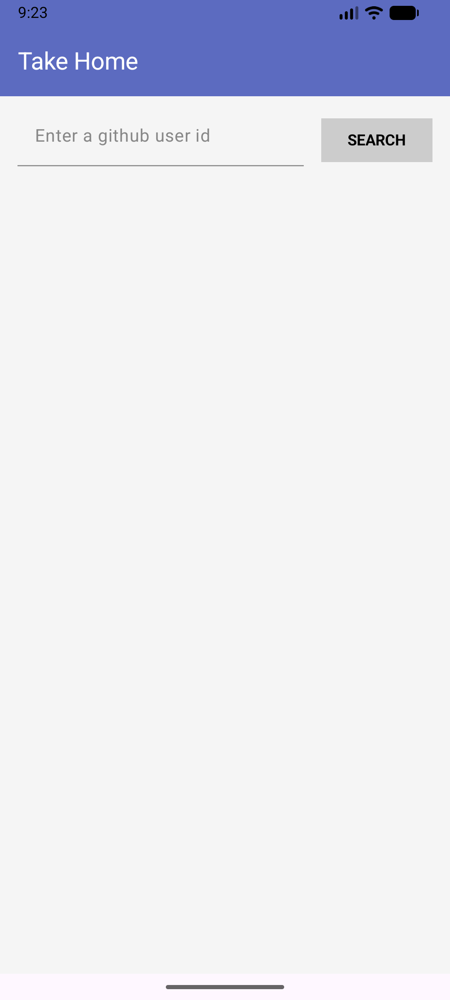
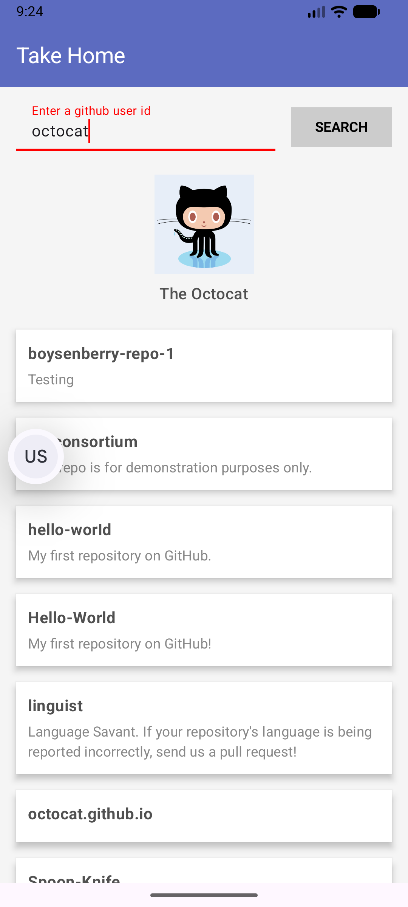
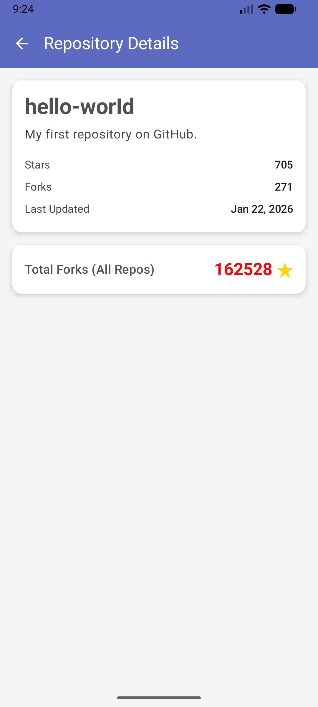

# TakeHomeJC

Github Viewer by Jetpack Compose

```text
 .
 ├── data/
 │   ├── api/
 │   │   └── GitHubApiService.kt          # Retrofit API interface
 │   ├── model/
 │   │   ├── User.kt                      # User data model
 │   │   └── Repository.kt                # Repo data model
 │   └── repository/
 │       └── GitHubRepository.kt          # Repository pattern implementation
 ├── ui/
 │   ├── home/
 │   │   ├── HomeScreen.kt                # Main screen with search + list
 │   │   └── HomeViewModel.kt             # ViewModel for home screen
 │   ├── detail/
 │   │   ├── DetailScreen.kt              # Repo detail screen
 │   │   └── DetailViewModel.kt           # ViewModel for detail screen
 │   ├── components/
 │   │   ├── UserHeader.kt                # Avatar + name component
 │   │   ├── RepositoryItem.kt            # Repo list item component
 │   │   └── SearchBar.kt                 # Search input component
 │   ├── navigation/
 │   │   └── NavGraph.kt                  # Navigation setup
 │   └── theme/
 │       └── Color.kt                     # Updated with app colors (toobar)
 ├── di/
 │   └── AppContainer.kt                  # Manual DI with factory pattern
 └── MainActivity.kt                      # Entry point
```





